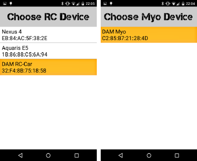
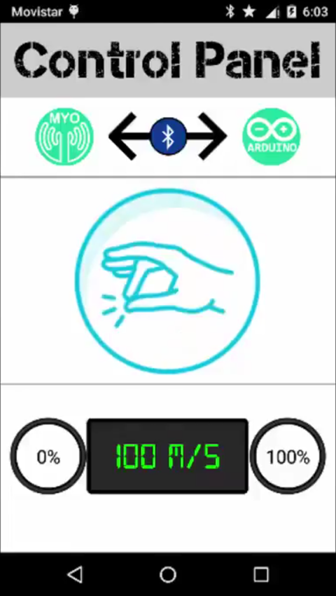
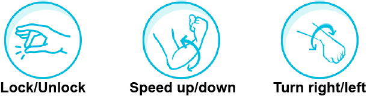

# Brazocar Android application

Android application to control an **RC Car** based on **Arduino** using your arm as the controller thanks to **[Myo Armband](https://www.myo.com)** device and **Bluetooth technology**.

Developed jointly by **[@samvrocks](https://github.com/samvrocks)** and **[@Javierma](https://github.com/Javierma)**.

  

  <a href="https://www.youtube.com/watch?v=PfhPWDUyZ_s">
    
     
    <b>Watch demo on YouTube!</b>
  </a>

## Requirements
* Android 4.0 device or higher.
* **[Helepolis Arduino Car](https://github.com/Javierma/Helepolis)** (developed by AETEL Telecom Electronics Society).
* **[Myo Armband device](https://www.myo.com)**.

## Instruction Manual
1. Download **[Brazocar APK](src/BrazoCar/bin/BrazoCar.apk)** and install it on your Android device.
2. Open the app and pair **Myo Armband** device and **Helepolis Arduino Car**.

  

3. Press **GO!** and take control of the RC car using next **available gestures**:

  

  

